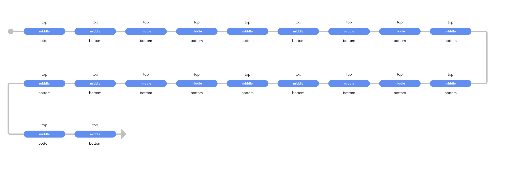

# vue-snake-timeline

## 开始使用
``` javascript
import VueSnakeTimeline from 'vue-snake-timeline'
import 'vue-snake-timeline/lib/vue-snake-timeline.css';
<VueSnakeTimeline @click="clickEvent" :items="items"> </VueSnakeTimeline>
```
## 效果展示



## props

items

``` javascript
new Array(20).fill({
    top: "top",
    middle: "middle",
    bottom: "bottom",
});
```

## event

click
